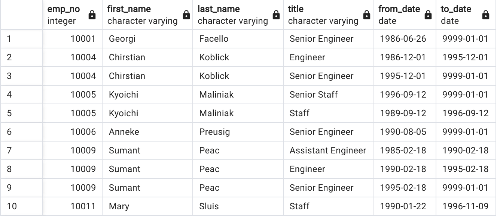
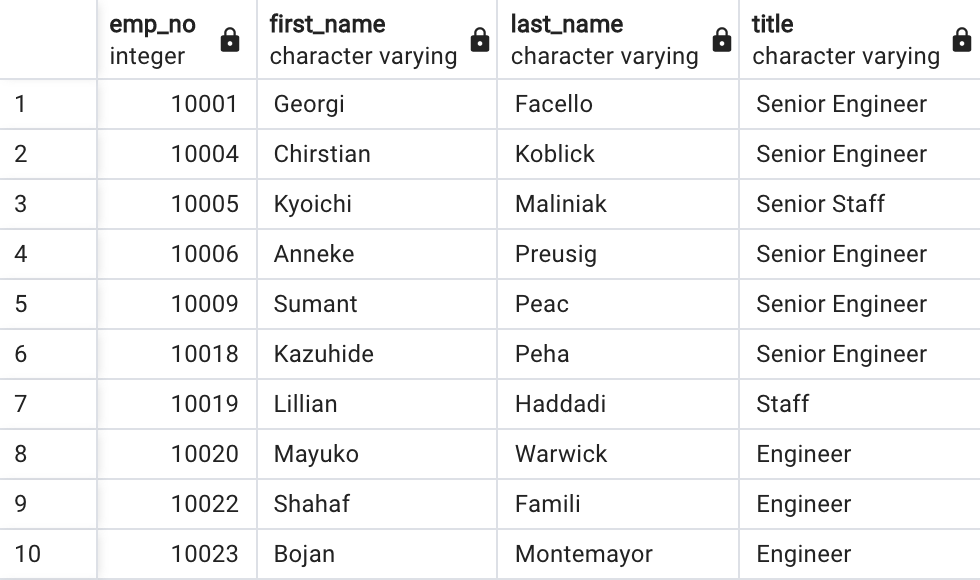
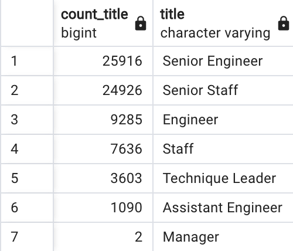
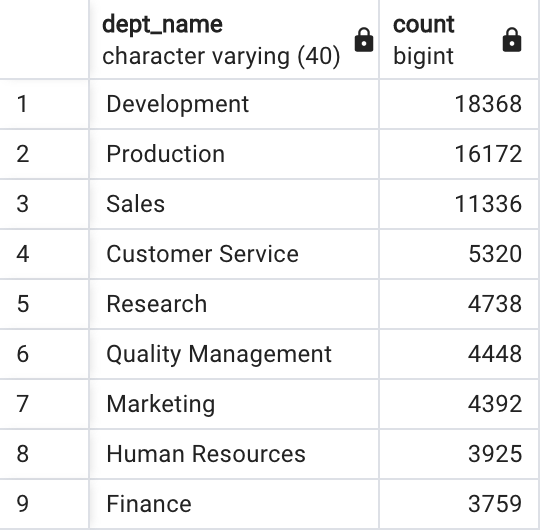
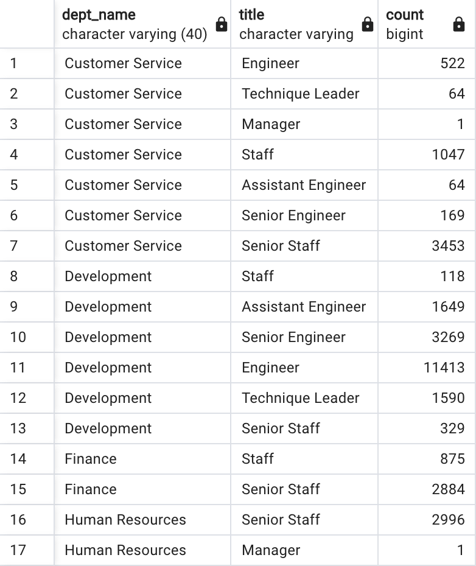

# Pewlett-Hackard-Analysis
## Overview of the Project:
The analysis was carried out at the request of Pewlett-Hackard, large organization which has several thousande employees. The management of the company wants to get prepared for the upcoming "silver tsunami". A large number of employee will start retiring in a few years. The company wants to be prepared with the retirement packages and open positions.

### Purpose:
The purpose of the project is to determine the number of retiring employees per title, and identify employees who are eligible to participate in a mentorship program.

## Results:

### 1. The list of retiring employees
- The query returns 133,776 rows of data.
- The table displays a list of employees who are going to retire in the next few years.
- The list is a start, but we have a few employees who changed positions over the years and their records are showing up twice. 
- The list contains all the titles that employees acquired while working at Pewlett-Hackard over the years. This resulted in duplicates, some employees appear twice or more.

### 2. The list of retiring employees without duplicates

- The query returns 72,458 rows.
- The table includes employee number, first name, last name, title, from-date and to-date.
- The table displays a list of employees who are going to retire in the next few years.
- This data is more useful because this lists the latest titles that the potential retiree has held.

### 3. The number of retiring employees grouped by title

- The number of potential retirees grouped by titles.
- The query returns 7 rows.
- This table shows how many employees with certain title will retire in the next few years.

### 4. The employees eligible for the mentorship program

- The query returns 1,549 rows.
- The table holds the current employees who were born between January 1, 1965 and December 31, 1965.
- The table displays a list of employees who is eligible for the mentorship program.
  

## Summary:
To sum up it is important to answer the following questions:
#### How many roles will need to be filled as the "silver tsunami" begins to make an impact?
72,458 roles need to be filled.
#### Are there enough qualified, retirement-ready employees in the departments to mentor the next generation of Pewlett Hackard employees?
No, there are only 1,549 employees eligible to participate in a mentorship program.

### Additional tables 
#### *Table A*
- The number of potential retirees grouped by departments.
- The query returns 9 rows.
- This table shows how many employees in certain departments will retire in the next few years.

#### *Table B*
- The number of potential retirees grouped by titles in departments.
- The query returns 42 rows.
- This table shows how many employees with certain title in certain department will retire in the next few years.

